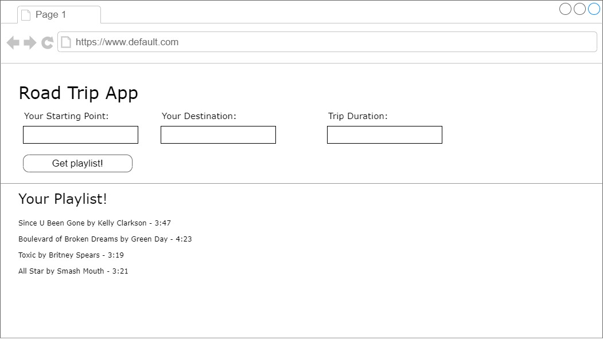

# Roadtrippers

## Objective
This application would create playlist of songs pulled from the Spotify API that would match the length of the duration of the user's trip according to data pulled from Google Maps API. 

## Problem addressed
Conundrum of a user's playlist or song ending either too early or too late based on their time spent in their vehicle; this app would also provide a playlist of songs with a set length to be enjoyed rather than the uncertainty of a playlist with a random length, as a list would be generated and provided at the initiation of the use of the app.

## Team members
Kayla Grogan
Jacob Zirbel
Alex Ascencio
A.J. MacDonald

## Wireframe
